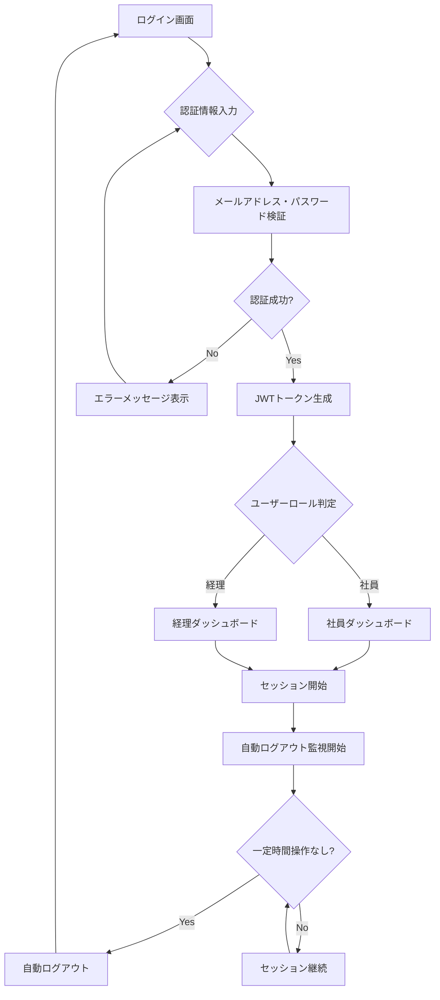
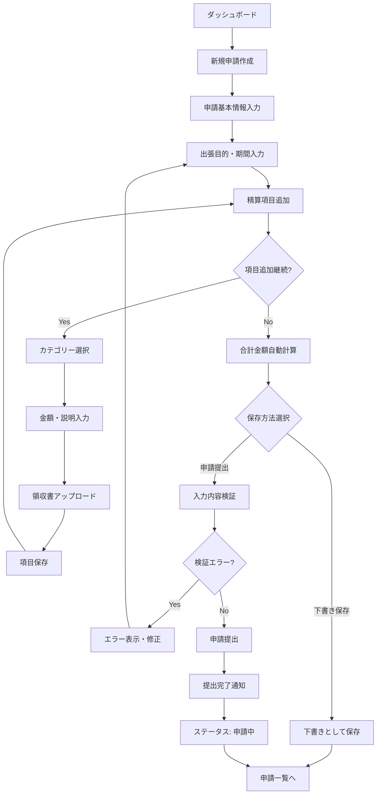
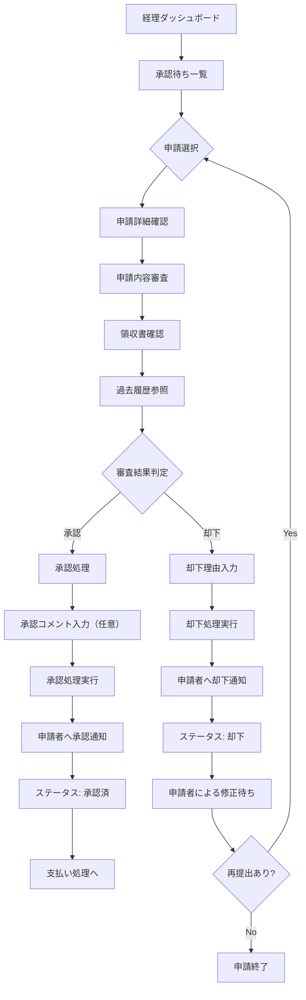
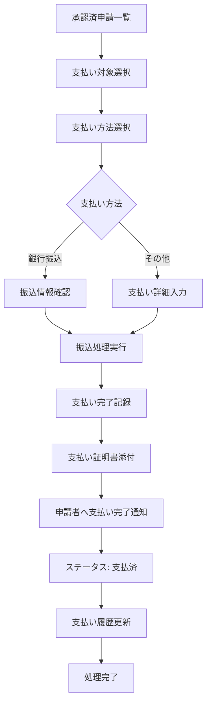
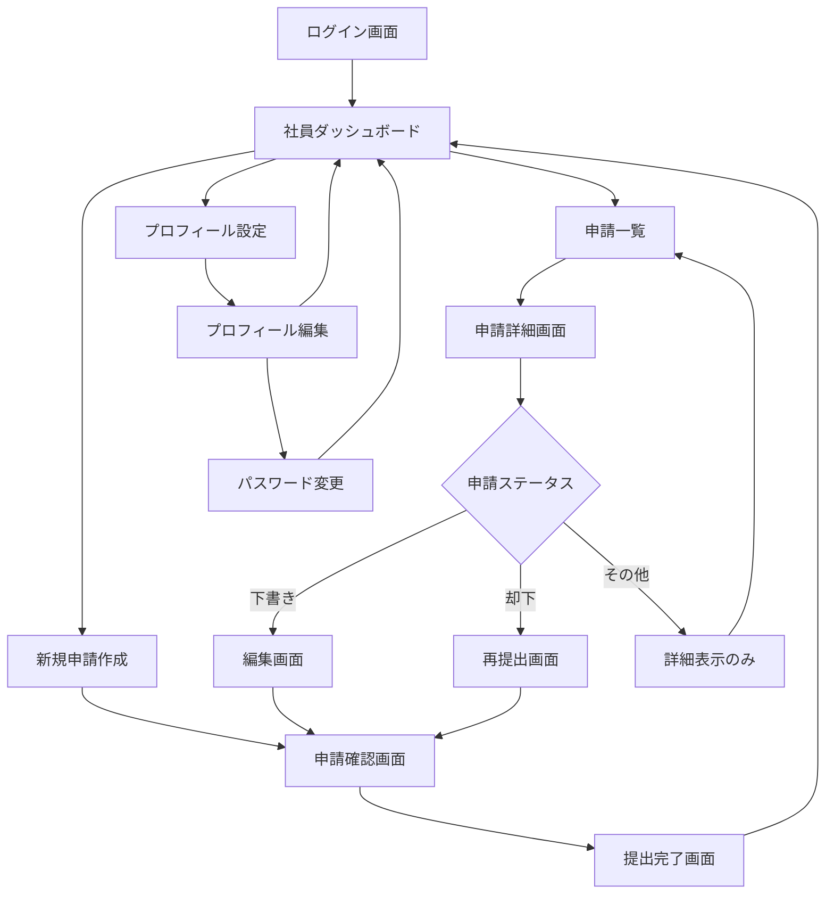
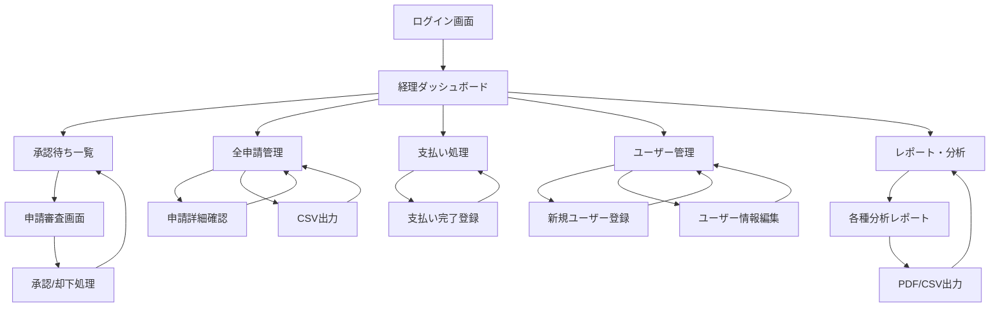
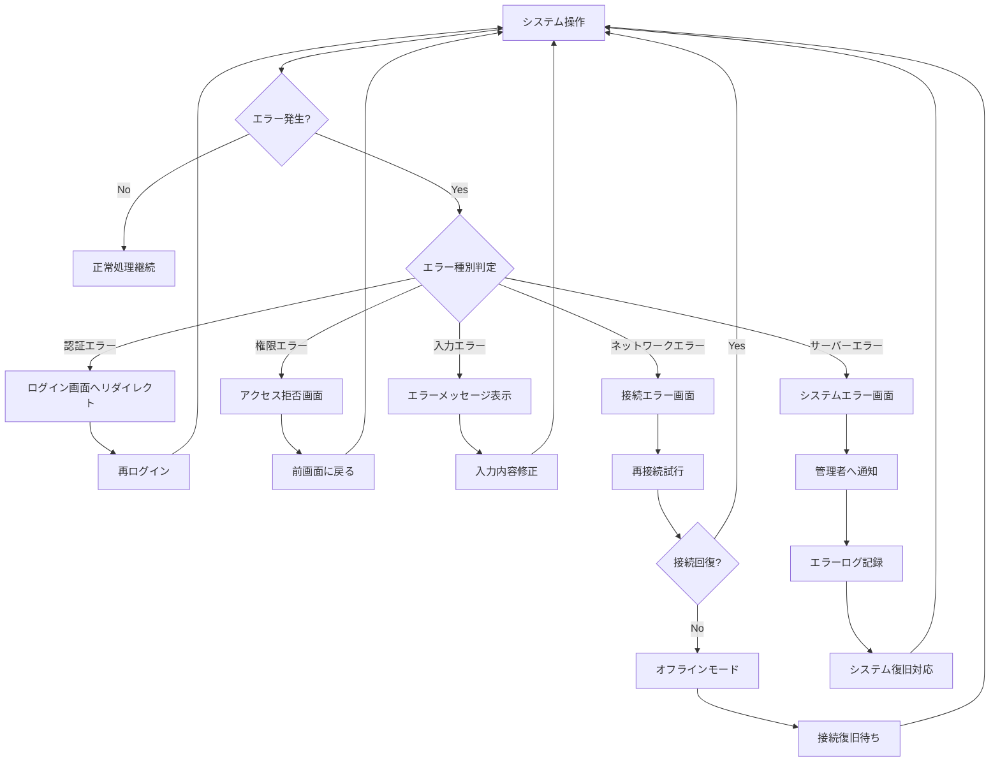
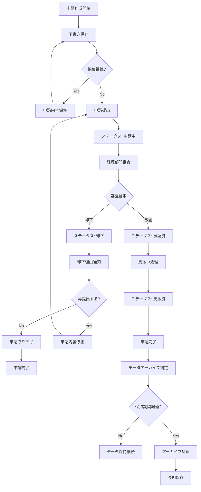
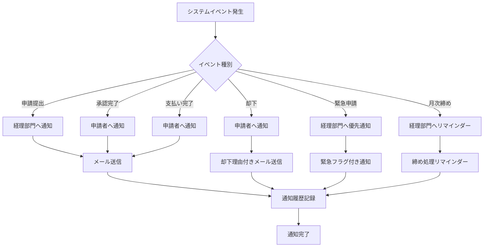

# 出張精算システム フローチャート

本文書では、出張精算システムの機能仕様に基づいたフローチャートをMermaid記法で記載します。

## 1. ユーザー認証フロー

## 2. 社員向け精算申請プロセスフロー

## 3. 経理部門承認プロセスフロー

## 4. 支払い処理フロー

## 5. 社員向け画面遷移フロー

## 6. 経理部門向け画面遷移フロー

## 7. 例外処理・エラーハンドリングフロー

## 8. 申請ライフサイクル全体フロー

## 9. 通知システムフロー

---

これらのフローチャートは、出張精算システムの機能仕様書に基づいて作成されており、システムの主要な業務プロセスと画面遷移を視覚的に表現しています。各フローは相互に関連し合い、全体として統合されたシステムの動作を示しています。